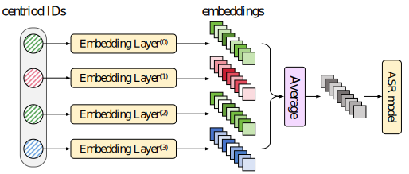

# Bridging the Gap between Continuous and Informative Discrete Representations by Random Product Quantization

This is the supplementary page of the paper "Bridging the Gap between Continuous and Informative Discrete Representations by Random Product Quantization" with a full `Fig. 6: Heatmap of correlation between feature dimensions of WavLM Large Layer 21.' and some reconstructed speech samples from different features.

[](https://arxiv.org/abs/2504.04721)
<!-- [](https://github.com/Aisaka0v0/CLAPSep)
[](https://huggingface.co/spaces/AisakaMikoto/CLAPSep) -->


## Abstract

Self-supervised learning (SSL) has become a core technique in speech processing, but the high dimensionality of its representations makes discretization essential for improving efficiency. However, existing discretization methods still suffer from significant information loss, resulting in a notable performance gap compared to continuous representations. To overcome these limitations, we propose two quantization-based discretization methods: Product Quantization (PQ) and Random Product Quantization (RPQ). PQ partitions the original feature space into multiple subspaces and independently quantizes each sub-vector, producing a fused set of discrete units that retain diverse information from different subspaces\textcolor{red}{, thereby} mitigating the loss associated with single-cluster quantization. RPQ further enhances representation diversity by randomly sampling feature dimensions multiple times to construct sub-vectors, thereby better capturing the variability in the data distribution. Theoretical analysis shows that RPQ reduces the correlation $\rho\ (0 \le \rho \le 1)$ between sub-quantizers, and its quantization error is lower-bounded by $\rho \varepsilon_{\text{kms}}$, where $\varepsilon_{\text{kms}}$ is the error of a single K-means quantizer. Experimental results show that, on the combined dataset constructed from LibriSpeech and ML-SUPERB, PQ and RPQ outperform standard K-means discretization, achieving relative improvements of 21.8\% and 20.0\% in word error rate (WER) on LibriSpeech, and 24.1\% and 19.6\% in character error rate (CER) on the ML-SUPERB, respectively. Moreover, their performance is competitive with, and in some cases even surpasses, that of continuous SSL representations.

<div align="center">
  
</div>
<script>
  (function(){
    const imgs = ['demo/figs/merge.svg', 'demo/figs/rpq.svg'];
    let idx = 0;
    const el = document.getElementById('carousel');
    // Preload
    imgs.forEach(s => { const p = new Image(); p.src = s; });
    setInterval(() => {
      idx = (idx + 1) % imgs.length;
      if (el) el.src = imgs[idx];
    }, 3000); // 切换间隔（毫秒），按需修改
  })();
</script>


## Supplementary material for 'Fig. 6: Heatmap of correlation between feature dimensions of WavLM-Large layer 21'.

<div align="center">
  <iframe src="demo/figs/100_wavlm_layer21_corr_full.pdf" width="100%" height="600px"></iframe>
</div>


## Supplementary material: Reconstructed speech samples from different features


<table style="margin: 0 auto;">
  <thead>
    <tr>
      <th>Original</th>
      <th>Reconstructed (SSL)</th>
      <th>Reconstructed (K-means)</th>
      <th>Reconstructed (PQ)</th>
      <th>Reconstructed (RPQ)</th>
    </tr>
  </thead>
  <tbody>
    <tr>
      <td><html><audio controls style="width: 200px;"><source src="demo/speech/original/61-70968-0005.wav"></audio></html></td>
      <td><html><audio controls style="width: 200px;"><source src="demo/speech/ssl/61-70968-0005.wav"></audio></html></td>
      <td><html><audio controls style="width: 200px;"><source src="demo/speech/kms/61-70968-0005.wav"></audio></html></td>
      <td><html><audio controls style="width: 200px;"><source src="demo/speech/pq/61-70968-0005.wav"></audio></html></td>
      <td><html><audio controls style="width: 200px;"><source src="demo/speech/rpq/61-70968-0005.wav"></audio></html></td>
    </tr>
    <tr>
      <td><html><audio controls style="width: 200px;"><source src="demo/speech/original/237-126133-0001.wav"></audio></html></td>
      <td><html><audio controls style="width: 200px;"><source src="demo/speech/ssl/237-126133-0001.wav"></audio></html></td>
      <td><html><audio controls style="width: 200px;"><source src="demo/speech/kms/237-126133-0001.wav"></audio></html></td>
      <td><html><audio controls style="width: 200px;"><source src="demo/speech/pq/237-126133-0001.wav"></audio></html></td>
      <td><html><audio controls style="width: 200px;"><source src="demo/speech/rpq/237-126133-0001.wav"></audio></html></td>
    </tr>
        <tr>
      <td><html><audio controls style="width: 200px;"><source src="demo/speech/original/672-122797-0031.wav"></audio></html></td>
      <td><html><audio controls style="width: 200px;"><source src="demo/speech/ssl/672-122797-0031.wav"></audio></html></td>
      <td><html><audio controls style="width: 200px;"><source src="demo/speech/kms/672-122797-0031.wav"></audio></html></td>
      <td><html><audio controls style="width: 200px;"><source src="demo/speech/pq/672-122797-0031.wav"></audio></html></td>
      <td><html><audio controls style="width: 200px;"><source src="demo/speech/rpq/672-122797-0031.wav"></audio></html></td>
    </tr>
        <tr>
      <td><html><audio controls style="width: 200px;"><source src="demo/speech/original/1188-133604-0005.wav"></audio></html></td>
      <td><html><audio controls style="width: 200px;"><source src="demo/speech/ssl/1188-133604-0005.wav"></audio></html></td>
      <td><html><audio controls style="width: 200px;"><source src="demo/speech/kms/1188-133604-0005.wav"></audio></html></td>
      <td><html><audio controls style="width: 200px;"><source src="demo/speech/pq/1188-133604-0005.wav"></audio></html></td>
      <td><html><audio controls style="width: 200px;"><source src="demo/speech/rpq/1188-133604-0005.wav"></audio></html></td>
    </tr>
        <tr>
      <td><html><audio controls style="width: 200px;"><source src="demo/speech/original/1284-1180-0028.wav"></audio></html></td>
      <td><html><audio controls style="width: 200px;"><source src="demo/speech/ssl/1284-1180-0028.wav"></audio></html></td>
      <td><html><audio controls style="width: 200px;"><source src="demo/speech/kms/1284-1180-0028.wav"></audio></html></td>
      <td><html><audio controls style="width: 200px;"><source src="demo/speech/pq/1284-1180-0028.wav"></audio></html></td>
      <td><html><audio controls style="width: 200px;"><source src="demo/speech/rpq/1284-1180-0028.wav"></audio></html></td>
    </tr>
        <tr>
      <td><html><audio controls style="width: 200px;"><source src="demo/speech/original/3570-5695-0008.wav"></audio></html></td>
      <td><html><audio controls style="width: 200px;"><source src="demo/speech/ssl/3570-5695-0008.wav"></audio></html></td>
      <td><html><audio controls style="width: 200px;"><source src="demo/speech/kms/3570-5695-0008.wav"></audio></html></td>
      <td><html><audio controls style="width: 200px;"><source src="demo/speech/pq/3570-5695-0008.wav"></audio></html></td>
      <td><html><audio controls style="width: 200px;"><source src="demo/speech/rpq/3570-5695-0008.wav"></audio></html></td>
    </tr>
        <tr>
      <td><html><audio controls style="width: 200px;"><source src="demo/speech/original/4507-16021-0001.wav"></audio></html></td>
      <td><html><audio controls style="width: 200px;"><source src="demo/speech/ssl/4507-16021-0001.wav"></audio></html></td>
      <td><html><audio controls style="width: 200px;"><source src="demo/speech/kms/4507-16021-0001.wav"></audio></html></td>
      <td><html><audio controls style="width: 200px;"><source src="demo/speech/pq/4507-16021-0001.wav"></audio></html></td>
      <td><html><audio controls style="width: 200px;"><source src="demo/speech/rpq/4507-16021-0001.wav"></audio></html></td>
    </tr>
        <tr>
      <td><html><audio controls style="width: 200px;"><source src="demo/speech/original/5639-40744-0030.wav"></audio></html></td>
      <td><html><audio controls style="width: 200px;"><source src="demo/speech/ssl/5639-40744-0030.wav"></audio></html></td>
      <td><html><audio controls style="width: 200px;"><source src="demo/speech/kms/5639-40744-0030.wav"></audio></html></td>
      <td><html><audio controls style="width: 200px;"><source src="demo/speech/pq/5639-40744-0030.wav"></audio></html></td>
      <td><html><audio controls style="width: 200px;"><source src="demo/speech/rpq/5639-40744-0030.wav"></audio></html></td>
    </tr>
        <tr>
      <td><html><audio controls style="width: 200px;"><source src="demo/speech/original/7127-75947-0023.wav"></audio></html></td>
      <td><html><audio controls style="width: 200px;"><source src="demo/speech/ssl/7127-75947-0023.wav"></audio></html></td>
      <td><html><audio controls style="width: 200px;"><source src="demo/speech/kms/7127-75947-0023.wav"></audio></html></td>
      <td><html><audio controls style="width: 200px;"><source src="demo/speech/pq/7127-75947-0023.wav"></audio></html></td>
      <td><html><audio controls style="width: 200px;"><source src="demo/speech/rpq/7127-75947-0023.wav"></audio></html></td>
    </tr>
        <tr>
      <td><html><audio controls style="width: 200px;"><source src="demo/speech/original/8555-284449-0017.wav"></audio></html></td>
      <td><html><audio controls style="width: 200px;"><source src="demo/speech/ssl/8555-284449-0017.wav"></audio></html></td>
      <td><html><audio controls style="width: 200px;"><source src="demo/speech/kms/8555-284449-0017.wav"></audio></html></td>
      <td><html><audio controls style="width: 200px;"><source src="demo/speech/pq/8555-284449-0017.wav"></audio></html></td>
      <td><html><audio controls style="width: 200px;"><source src="demo/speech/rpq/8555-284449-0017.wav"></audio></html></td>
    </tr>

  </tbody>
</table>


## Citation
```
@article{li2025bridging,
  title={Bridging the Gap between Continuous and Informative Discrete Representations by Random Product Quantization},
  author={Li, Xueqing and Ma, Hao and Li, Zehan and Zhu, Boyu and Jing, Ruihao and Kang, Jian and Li, Jie and Zhang, Chi and Zhang, Xiao-Lei and Li, Xuelong},
  journal={arXiv preprint arXiv:2504.04721},
  year={2025}
}
```
